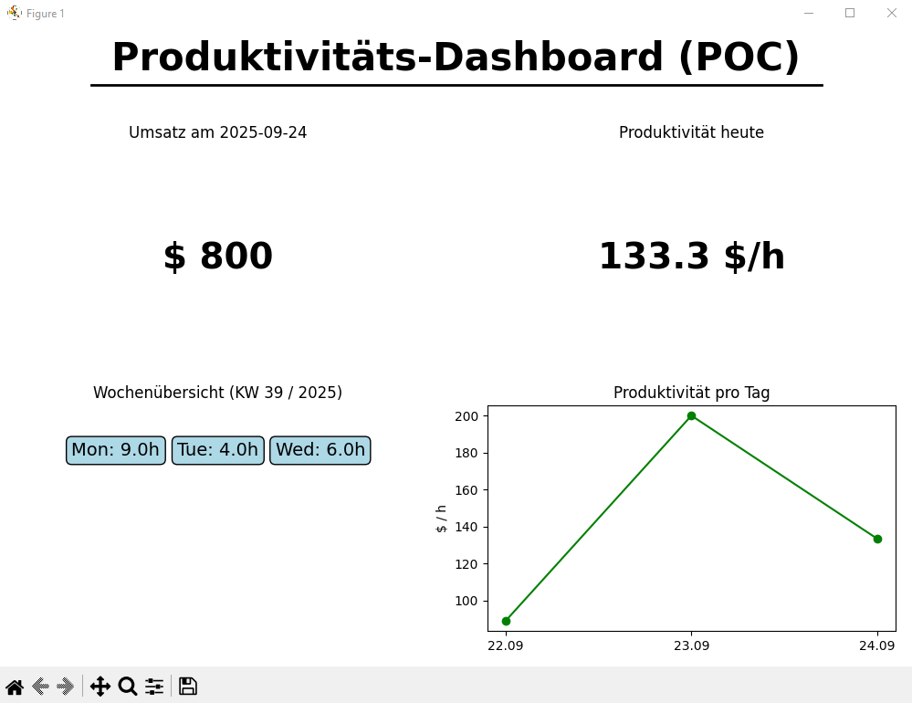

# Toggl KPI Dashboard (POC)


[](README_en.md)
[](README.md)

## Overview
This project is a **Proof of Concept** for analyzing Toggl Track data.  
It demonstrates how to automatically fetch time entries, clean them, and visualize them in a small dashboard.  
The goal: From raw data to KPIs and visualizations within seconds.



## Features
- **API integration** with Toggl Track (via personal API key)
- **Dummy mode**: Can be started with test data if no API key is available
- **KPIs**:
  - Working hours per day
  - Hours per description
  - Productivity ($/h) based on a fixed dummy revenue
- **Dashboard** (matplotlib):
  - Daily revenue (fixed placeholder: $800)
  - Productivity today
  - Weekly overview (hours per day)
  - Productivity per day (chart)
- **CSV export** for further analysis

## Installation
1. Clone the repository:
   ```bash
   git clone https://github.com/Chrisp-Codes/toggl-kpi-dashboard-poc.git
   cd toggl-kpi-dashboard-poc/src
   ```
2. Install dependencies:
   ```bash
   pip install -r requirements.txt
   ```
3. Start the project:
   ```bash
   python main.py
   ```

## Usage
On the first run without a `.env` file, you will be prompted to enter your Toggl API key.  
The key will be stored locally in a `.env` file for future runs.  

Alternatively, the project can be started in **dummy mode** (prompt at startup).  

## Requirements
- Python 3.10+  
- Packages: `requests`, `python-dotenv`, `pandas`, `matplotlib`

## License
This project is licensed under the [MIT License](https://opensource.org/licenses/MIT).
